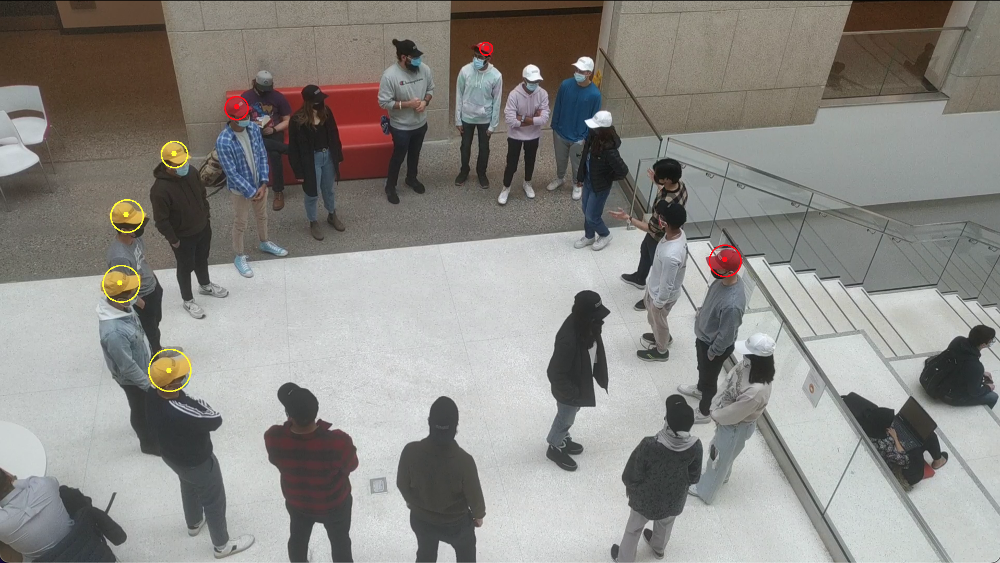

# ENGG200-ColoredHats

## Requirements
imutils==0.5.4

numpy==1.21.5

opencv-python==4.5.5.62

pandas==1.4.1
## Usage
### HSV range detection
Using the command below, run the range detection program for the video file you want to do the tracking on.
In the opened window you see 6 trackbars, each pair determining the lower and upper bounds for each of the HSV values of the color of interest.
To track each object of a specific color, you need to first find the best range to filter out all other colors but the one of interest.
Once the only objects showing up on the screen were the ones (of the same color) you intend to track, you can hit "s" to print out the integer values defining the ranges in the conosle.
You can hit "p" on the keyboard to play/pause the video, the video is paused by default.
For more information on HSV, and a comparison to RGB, see this documentation.
```
python range.py [-h] [-v VIDEO]
```
#### required arguments:

  -v VIDEO, --video VIDEO
                        path to the video file


python detect.py [-h] [-v VIDEO] [-b BUFFER]
Once you have all the ranges for all the colors you need to track, you should put them in the colors dictionary defined on line 21, each associated with a label - as the key. 
Now you can input the path to the video, the minimum radius (in pixels) you would want an object to occupy in the frame in order to be detected, and a path to the output file where the program will record the coordinates of each object at each frame.
#### required arguments:

  -v VIDEO, --video VIDEO
                        path to the video file
  -r RADIUS, --radius RADIUS
                        Minimum radius (in pixels) of the object to be detected
  -o OUTPUT, --output OUTPUT
                        Filename to save the coordinates of the detected objects


## Example
Using the command below:
python range.py -v sample.mp4

We extract the following ranges for the yellow and the red caps, we put them in the "bounds" key of the associated labels "Y" and "R", along with the rgb value of the color(used for visualization, precision not required)
```
"Y": {
    "bounds": [[12, 138, 147], [28, 208, 229]],
    "rgb": [0, 255, 255]
  },
  "R": {
    "bounds": [[177, 144, 95], [179, 255, 228]],
    "rgb": [0, 0, 255]
  }
```

Then, by putting the information in line 21 of the detect.py file, by running the following command, we will detect each object with the color in the specified rangesin sample.mp4, that has a radius of at least 10 pixels, and extract the coordinates data into sample.csv.
```
python detect.py -v sample.mp4 -r 10 -o sample.csv
```
While processing, you can see the detections in the window, like below:

